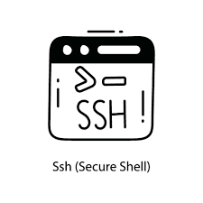
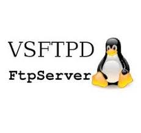
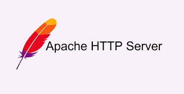
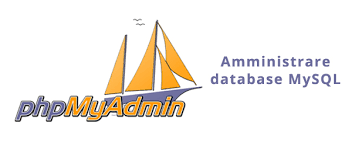
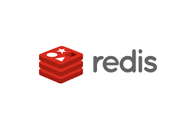
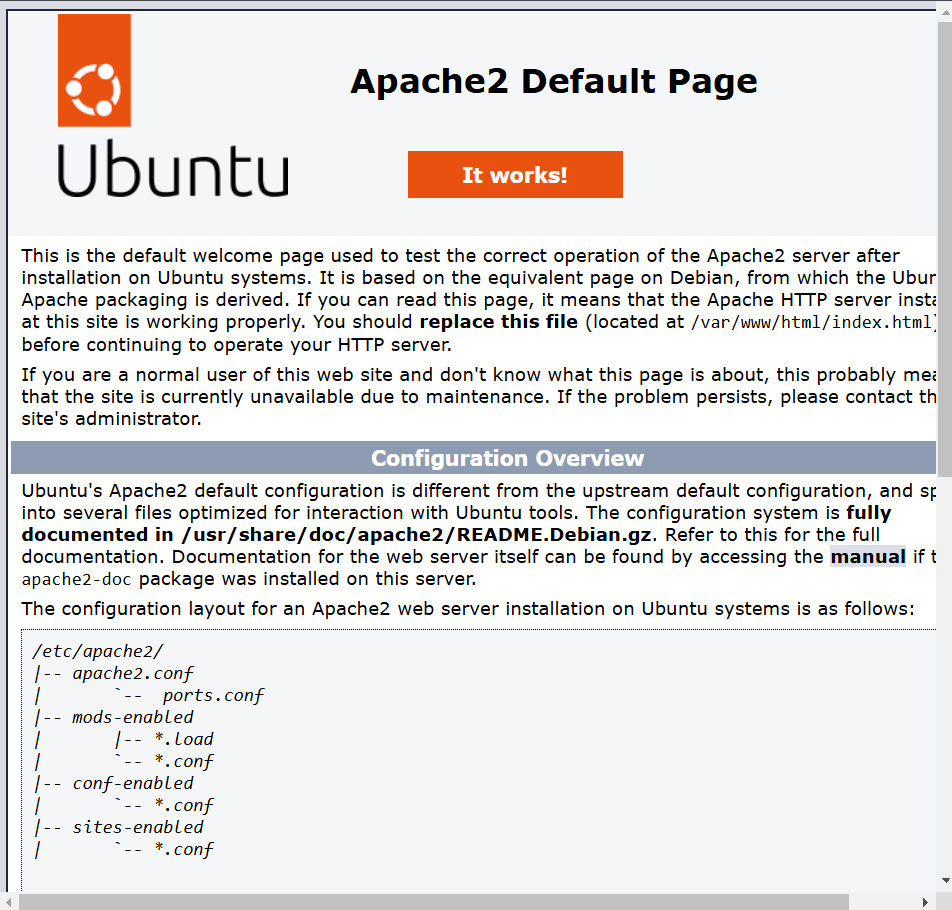
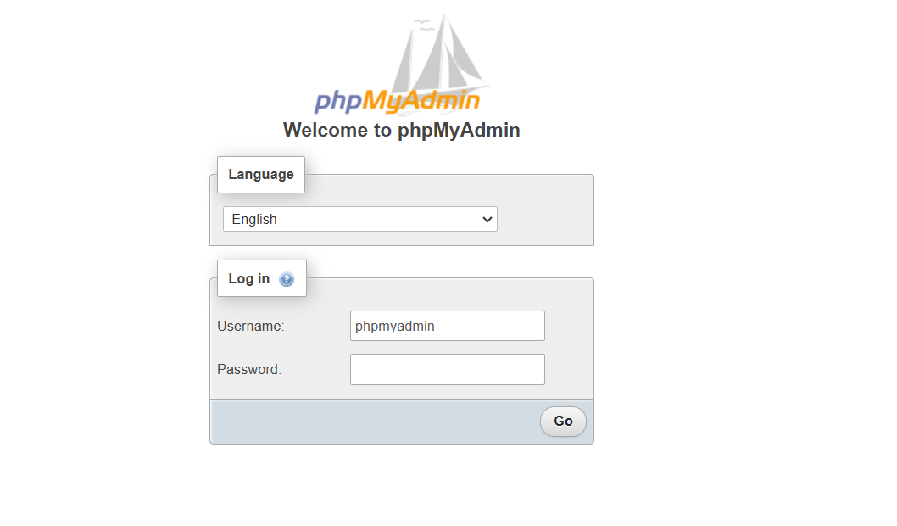
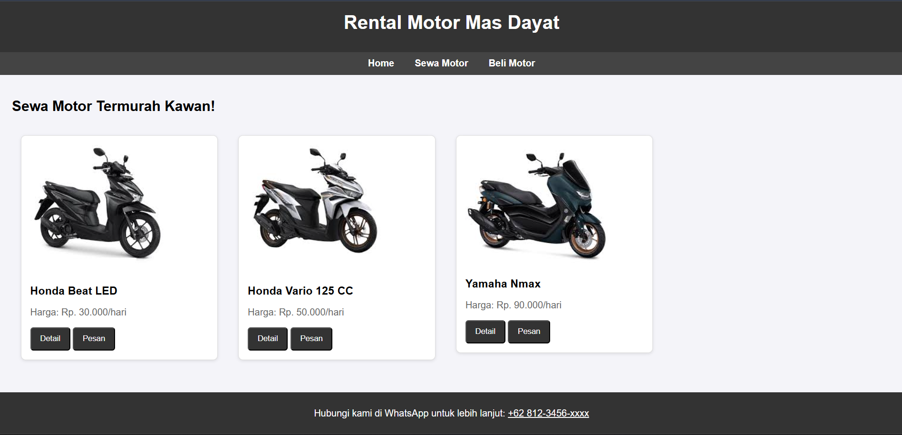
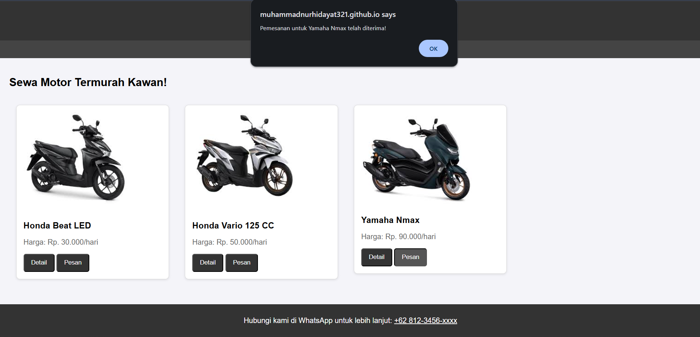

# Final Project OS Server - Sewa Motor Web Server (04-12-2024)

- Nama : MUHAMMAD NUR HIDAYAT 
- Nim : 23.83.0993
- Matkul : OS Server & Sistem Admin

## OS yang digunakan (04-12-2024)
- Ubuntu Server 24.04.1
- RAM 8GB
- Storage 15GB

## Layanan (04-12-2024)
- OpenSSH 
Sebagai : SSH Server/Remote Access Tool



- vsFTPD
Sebagai : FTP Server



- Apache2
Sebagai : FTP Server



- MySQL dan phpMyAdmin
Sebagai : Database Server



- Redis
Sebagai : Cache Server



## 1. Instalasi OPEN SSH SERVER
Langkah 1: Lakukan Instalasi Paket SSH Server 
``` 
sudo apt install openssh-server -y 
```
Langkah 2: Mengaktifkan Layanan ssh server
```
sudo systemctl enable ssh
```
Langkah 3: Memulai Layanan SSH SERVER
```
sudo systemctl start ssh
```
Langkah 4: Cek ip ubuntu server
```
ip add
```
Langkah 5: Cek status SSH SERVER
```
sudo systemctl status ssh
```
Untuk melakukan remote menggunakan ssh gunakan perintah, Contoh ssh ghalih@123.456.789
```
ssh [username]@[ip addess]
```

## 2. Instalasi FTP SERVER
1. Instalasi FTP Server
Langkah 1. Masuk ke terminal Ubuntu dan instal layanan vsftpd:
Copy code
```
sudo apt update
sudo apt install vsftpd
```
Langkah 2. Pastikan layanan vsftpd berjalan:
Copy code
```
sudo systemctl start vsftpd
sudo systemctl enable vsftpd
```
2. Konfigurasi FTP Server
Langkah 1. Edit file konfigurasi vsftpd:
Copy code
```
sudo nano /etc/vsftpd.conf
```

### Langkah 3. edit file
anonymous_enable=NO
local_enable=YES
write_enable=YES

## 3. Instalasi WEB SERVER
Instalasi Apache2
Langkah 1: Instalasi Paket Apache2
```
apt update && apt upgrade
apt-get install apache2
```

Konfigurasi Apache2
Langkah 1: Buka File Konfigurasi Apache2
```
nano /etc/apache2/sites-available/000-default.conf
```

Langkah 2: Sesuaikan Konfigurasi dengan domain yang anda gunakan

Lengkah 3: Restart Layanan Apache2
```
systemctl restart apache2
```

Langkah 4: Cek Apache2
```
systemctl status apache2
```

Konfigurasi ufw
```
ufw allow in "Apache"
ufw status
```
Akses Apache2 di browser dengan ketik ip server anda 


## 4. Instalasi DATABASE SERVER
1. Instalasi
Langkah 1:Installasi paket mariadb
```
sudo apt-get update
sudo apt-get install mariadb-server
```
Langkah 2:Untuk mengamankan installasi (Opsional)
```
sudo mysql_secure_installation
```

Langkah 3:Lakukan instalasi paket
```
sudo apt-get install phpmyadmin
```

Langkah 4:Restart ulang layanan
```
sudo systemctl restart apache2
```


## 5. Redis (Cache Server)
1.Instal Redis dengan perintah berikut:
```
sudo apt install redis-server -y
```
2.Verifikasi instalasi Redis:
```
redis-server --version
```
3.Mulai dan Aktifkan Redis
```
sudo systemctl start redis
```
4.Aktifkan layanan Redis agar berjalan otomatis saat booting:
```
sudo systemctl enable redis
```
5.Periksa status Redis:
```
sudo systemctl status redis
```

## 6. Pengaplikasian website
1. Konfigurasi file kedalam ubuntu
Langkah 1: pemindahan file Kita dapat memindahkan file html yang telah dibuat dengan menggunakan Filezilla FTP, atau dengan git clone website yang telah dibuat (disini saya menggunakan git clone saja).
```
cd /tmp && git clone "nama repository"
```
Langkah 2: salin direktori html kedalam direktori /var/www/html.
```
cp -R "nama direktori web" /var/www/html/
```
Langkah 3: Mengubah kepemilikan direktori web. dan Memodifikasi izin file.
```
chown -R www-data:www-data /var/www/html/"nama direktori web"/
chmod -R 755 /var/www/html/"nama direktori web"/
```
Langkah 4: Konfigurasikan apache untuk memuat web.
```
cd /etc/apache2/sites-available
cp 000-default.conf web.conf
```
Masuk kedalam file web.conf dan ganti DocumentRoot menjadi halaman web mu
```
nano web.conf
DocumentRoot /var/www/html/"nama direktori web"
```
Aktifkan web.conf dan muat ulang layanan apache.
```
a2ensite web.conf
systemctl reload apache2
```
#### Tampilan web
Tampilan Home


Tampilan pesan 

